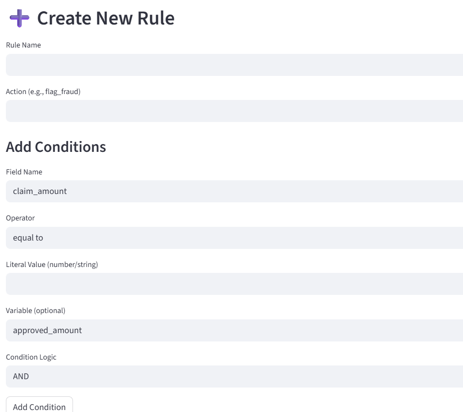

# 🛠️ Rule Builder System (FastAPI + Streamlit + SQL Server)

A **no-code rule builder** for creating, managing, testing, and executing rules on claim data.  
Rules are stored in **SQL Server (SSMS)** and managed via a **FastAPI backend** and a **Streamlit UI**.  

---

## 🚀 Features
- Create rules with multiple conditions.  
- Store, update, and delete rules in **SQL Server**.  
- Test rules against sample JSON records.  
- **Streamlit UI** for easy interaction.  
- **FastAPI backend** for rule management & evaluation.  

---

## 📂 Files
```
.
├── backend.py        # FastAPI server
├── ui.py             # Streamlit frontend
├── requirements.txt  # Python dependencies
```

---

## 🔧 Setup Instructions

### 1️⃣ Clone the Repository
```bash
git clone https://github.com/<your-username>/<your-repo>.git
cd <your-repo>
```

### 2️⃣ Create Virtual Environment
```bash
python -m venv venv
source venv/bin/activate   # Linux/Mac
venv\Scripts\activate      # Windows
```

### 3️⃣ Install Dependencies
```bash
pip install -r requirements.txt
```

---

## 🗄️ Database Setup (SQL Server)

1. Open **SQL Server Management Studio (SSMS)**.  
2. Create a new database (example: `RuleDB`):  
   ```sql
   CREATE DATABASE RuleDB;
   ```
3. Inside `RuleDB`, create a table for storing rules:  
   ```sql
   CREATE TABLE Rules (
       id INT PRIMARY KEY IDENTITY(1,1),
       rule_name NVARCHAR(255) UNIQUE NOT NULL,
       conditions NVARCHAR(MAX) NOT NULL,
       logic NVARCHAR(10) NOT NULL,
       action NVARCHAR(255) NOT NULL
   );
   ```
4. Update your **connection string** in `backend.py`:
   ```python
   DB_CONNECTION = "Driver={ODBC Driver 17 for SQL Server};Server=localhost;Database=RuleDB;Trusted_Connection=yes;"
   ```

---

## ▶️ Running the Project

### Start FastAPI Backend
```bash
python backend.py
```
- Runs at: **http://localhost:8000**  
- API docs: **http://localhost:8000/docs**

### Start Streamlit UI
```bash
streamlit run ui.py
```
- Opens at: **http://localhost:8501**

---

## 🧪 Example Workflow
1. Open the **Streamlit UI**.  
2. Create a rule → Add multiple conditions (field, operator, value, logic).  
3. Save rule → Stored in **SQL Server**.  
4. Manage rules → Update / Delete / Test.  
5. Test rule → Enter sample JSON → See evaluation result.  

---

## 📸 Sample Screenshots

### Create New Rule


### Manage Rules (Edit / Delete)


### Test Rule


---

## 📌 Requirements
- Python **3.9+**  
- SQL Server (local or remote instance)  
- ODBC Driver 17 for SQL Server  

---

## 📝 License
MIT License – free to use and modify.  
